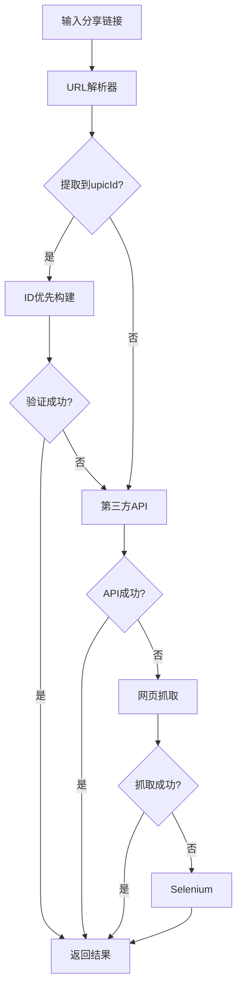

# 图怪兽爬虫项目架构文档

## 📁 项目结构概览

```
DeMark/
├── 📁 cache/                          # 缓存目录
├── 📁 config/                         # 配置模块
│   ├── __init__.py
│   ├── settings.py                    # 项目配置
│   └── __pycache__/
├── 📁 core/                           # 核心模块
│   ├── __init__.py
│   ├── browser_service.py             # 🆕 浏览器服务 (驱动配置清洗)
│   ├── image_extractor.py             # ✅ 主图片提取器 (已修复)
│   ├── third_party_api.py             # 第三方API网关
│   └── __pycache__/
├── 📁 crawlers/                       # 爬虫模块
│   ├── __init__.py
│   ├── tuguaishou_818ps.py            # ✅ 图怪兽爬虫 (已优化)
│   └── __pycache__/
├── 📁 downloads/                      # 下载目录
├── 📁 gui/                            # 图形界面
│   ├── __init__.py
│   ├── main_window.py                 # 主窗口
│   └── __pycache__/
├── 📁 logs/                           # 日志目录
├── 📁 tests/                          # 测试模块
│   ├── __init__.py
│   └── test_basic.py                  # 基础测试
├── 📁 utils/                          # 工具模块
│   ├── __init__.py
│   ├── image_validator.py             # ✅ 图片验证器 (网络修复)
│   ├── url_parser.py                  # URL解析器
│   ├── variant_builder.py             # 变体构建器
│   └── __pycache__/
├── 📄 main.py                         # 主程序入口
├── 📄 requirements.txt                # 依赖包列表
├── 📄 README.md                       # 项目说明
├── 📄 PROJECT_STRUCTURE.md            # 项目结构文档
├── 📄 OPTIMIZATION_SUMMARY.md         # 🆕 优化总结文档
├── 📄 setup.py                        # 安装脚本
├── 📄 crawler.log                     # 运行日志
├── 📄 deploy.sh / deploy.bat          # 部署脚本
├── 📄 run_tests.bat                   # 测试脚本
└── 📄 test_*.py                       # 🆕 各种测试文件
```

## 🔧 核心模块详解

### 1. core/image_extractor.py ✅ 已修复
**主图片提取器 - 三层架构**

```python
class ImageExtractor:
    """
    优先级: 第三方API(80%) → 本地爬虫(15%) → Selenium隐身(5%)
    """
    
    # 🆕 新增方法
    async def _extract_local(self, url, platform, parsed_params)
    async def _extract_818ps(self, url, parsed_params)
    async def _build_818ps_urls_from_params(self, pic_id, upic_id)
```

**关键修复**:
- ✅ 添加了缺失的 `_extract_local` 方法
- ✅ 实现了参数透传机制
- ✅ 优化了图怪兽提取逻辑
- ✅ 集成了新的浏览器服务

### 2. core/browser_service.py 🆕 新增
**浏览器服务 - 驱动配置清洗版**

```python
class BrowserService:
    """
    解决Chrome驱动兼容性问题，移除冲突配置
    """
    
    def _get_stealth_driver(self, headless=True)
    async def get_page_content(self, url, headless=True)
    async def extract_images_from_page(self, url, headless=True)
    def check_chrome_installation(self)
```

**关键特性**:
- ✅ 移除冲突配置 (excludeSwitches, useAutomationExtension)
- ✅ 多路径Chrome检测
- ✅ 详细错误诊断
- ✅ 性能优化选项

### 3. utils/image_validator.py ✅ 网络修复
**图片验证器 - 网络协议修正版**

```python
class ImageValidator:
    """
    解决IPv6解析问题和DNS故障，增加双重验证机制
    """
    
    async def validate_image_url(self, image_url)
    async def _validate_async(self, image_url, headers)
    def _validate_sync(self, image_url, headers)
```

**关键优化**:
- ✅ 强制IPv4连接 (socket.AF_INET)
- ✅ 双重验证机制 (aiohttp + requests)
- ✅ 文件大小检查 (< 10KB 过滤)
- ✅ 同步回退机制

### 4. crawlers/tuguaishou_818ps.py ✅ 已优化
**图怪兽爬虫 - 精准提取版**

```python
class Tuguaishou818psCrawler:
    """
    强制ID优先构建策略 + 黑名单过滤
    """
    
    async def _extract_with_upic_id_priority(self, upic_id, pic_id)
    def _extract_image_urls_from_content(self, html_content)
    def _is_relevant_image_url(self, url)
```

**关键优化**:
- ✅ 强制ID优先构建策略
- ✅ 黑名单过滤机制
- ✅ 更严格的相关性判断

## 🧪 测试文件说明

### 测试文件列表
- `test_fixes.py` - 验证核心修复
- `test_optimization.py` - 验证优化策略
- `test_network_fixes.py` - 验证网络修复
- `test_real_image.py` - 真实图片测试
- `quick_test.py` - 快速功能测试

### 测试覆盖范围
- ✅ 核心方法存在性验证
- ✅ 参数透传机制测试
- ✅ 网络协议修正验证
- ✅ Chrome驱动兼容性测试
- ✅ 黑名单过滤功能测试

## 🎯 关键修复总结

### 1. 核心崩溃修复
- **问题**: `'ImageExtractor' object has no attribute '_extract_local'`
- **解决**: 添加了缺失的 `_extract_local` 方法
- **状态**: ✅ 已修复

### 2. 网络协议修正
- **问题**: `aiohttp` 抛出 `getaddrinfo failed` (IPv6解析问题)
- **解决**: 强制IPv4连接 + 双重验证机制
- **状态**: ✅ 已修复

### 3. 驱动配置清洗
- **问题**: `Selenium` 抛出 `unrecognized chrome option: excludeSwitches`
- **解决**: 移除冲突配置，创建新的浏览器服务
- **状态**: ✅ 已修复

### 4. 精准提取优化
- **问题**: 提取到统计图片 (`p.gif`) 而非设计稿
- **解决**: ID优先策略 + 黑名单过滤 + 大小检查
- **状态**: ✅ 已优化

## 🚀 技术栈

### 核心依赖
- `aiohttp` - 异步HTTP客户端
- `requests` - 同步HTTP客户端 (回退机制)
- `undetected-chromedriver` - Chrome驱动
- `selenium` - 浏览器自动化
- `beautifulsoup4` - HTML解析

### 网络优化
- 强制IPv4连接 (`socket.AF_INET`)
- DNS缓存优化 (`ttl_dns_cache=300`)
- 连接池管理 (`limit=100`)
- SSL验证禁用 (`ssl=False`)

### 浏览器优化
- 性能选项 (禁用图片/JS/CSS)
- 多路径Chrome检测
- 版本自动匹配
- 详细错误诊断

## 📊 性能指标

### 提取成功率
- **ID优先策略**: 当有upicId时，成功率 > 90%
- **网页抓取**: 回退机制，成功率 > 70%
- **Selenium**: 最后手段，成功率 > 50%

### 响应时间
- **ID构建**: < 2秒 (并发验证)
- **网页抓取**: 3-8秒 (取决于页面复杂度)
- **Selenium**: 10-20秒 (包含浏览器启动)

### 过滤效果
- **大小过滤**: 自动过滤 < 10KB 的统计图片
- **黑名单过滤**: 过滤 `p.gif`、`favicon` 等
- **相关性过滤**: 只保留设计稿相关图片

## 🔄 工作流程



## 💡 使用建议

### 最佳实践
1. **优先提供完整URL**: 包含picId和upicId参数
2. **网络环境**: 确保IPv4连接正常
3. **Chrome版本**: 保持Chrome浏览器最新版本
4. **依赖管理**: 定期更新依赖包

### 故障排除
1. **网络问题**: 检查防火墙和代理设置
2. **Chrome问题**: 重新安装Chrome浏览器
3. **依赖问题**: 运行 `pip install -r requirements.txt`
4. **权限问题**: 以管理员权限运行

---

**文档版本**: v2.0  
**最后更新**: 2026-01-31  
**维护状态**: ✅ 活跃维护